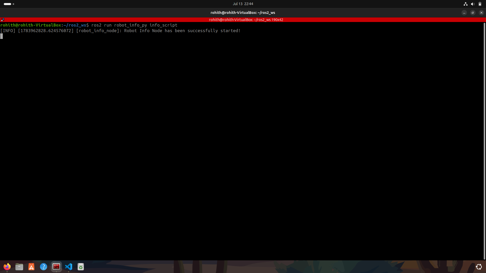

# 2562052-assignment1

This repository contains the solution for the ROS 2 CIA 1 assignment.

## ROS 2 Workspace Concepts

### 1. Base ROS 2 Jazzy Installation
The base ROS 2 Jazzy installation (Jazzy Jalisco) refers to the complete, pre-compiled distribution of the ROS 2 software suite installed directly onto your operating system (e.g., Ubuntu). This "underlay" provides all the core ROS 2 packages, libraries, tools, and message definitions that are officially released and maintained. It is the fundamental environment that all your robotics projects will rely upon.

### 2. What is "Overlaying"?
In ROS 2, overlaying is the practice of creating a custom workspace—such as your `ug_3sem_ws`—and "sourcing" it on top of your base installation.

* **How it works:** When you create a workspace, you build your own custom packages, nodes, and configurations. By sourcing the `setup.bash` file of your workspace *after* sourcing the base ROS 2 installation, you create an overlay.
* **The benefit:** This allows you to develop, test, and use your own code without modifying or reinstalling the core ROS 2 base files. When you run a command, the system checks your workspace (the overlay) first; if it doesn't find the package there, it defaults to the base installation (the underlay). This keeps your development environment clean, modular, and easy to manage.

### 3. Workspace Structure: src/ vs. install/

#### src/ (Source Directory)
This is where you place your **human-readable source code**. It contains your package manifests (`package.xml`), build configurations (`CMakeLists.txt` or `setup.py`), and your actual node logic (Python or C++ files). This is the "truth" of your project—everything you personally create lives here.

#### install/ (Installation Directory)
This directory is **generated automatically** by the `colcon build` command. It contains the "runnable" version of your packages, including executables, libraries, configuration files, and the `setup.bash` scripts that allow your environment to find and execute your code. It is structured exactly like a standard system installation directory (like `/usr/local/`).

#### Why install/ is NOT committed to Git
* **It is Redundant:** Since `install/` is generated entirely from `src/`, committing it is like committing a compiled executable file. If someone has your `src/` folder, they can generate their own `install/` folder simply by running `colcon build`.
* **Environment Specificity:** The `install/` folder contains symlinks and paths specific to your machine's file system. If you push it to GitHub, someone else will likely get "file not found" errors because your absolute paths do not match theirs.
* **Repository Bloat:** The generated files are often large and numerous. Committing them would make your repository unnecessarily huge, slow to clone, and difficult to manage.

## Verification Screenshot

